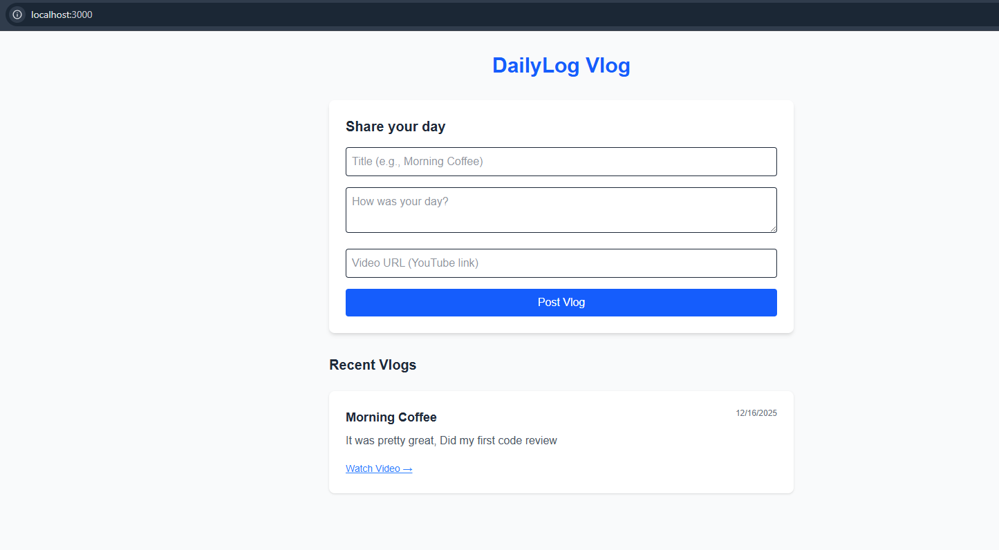
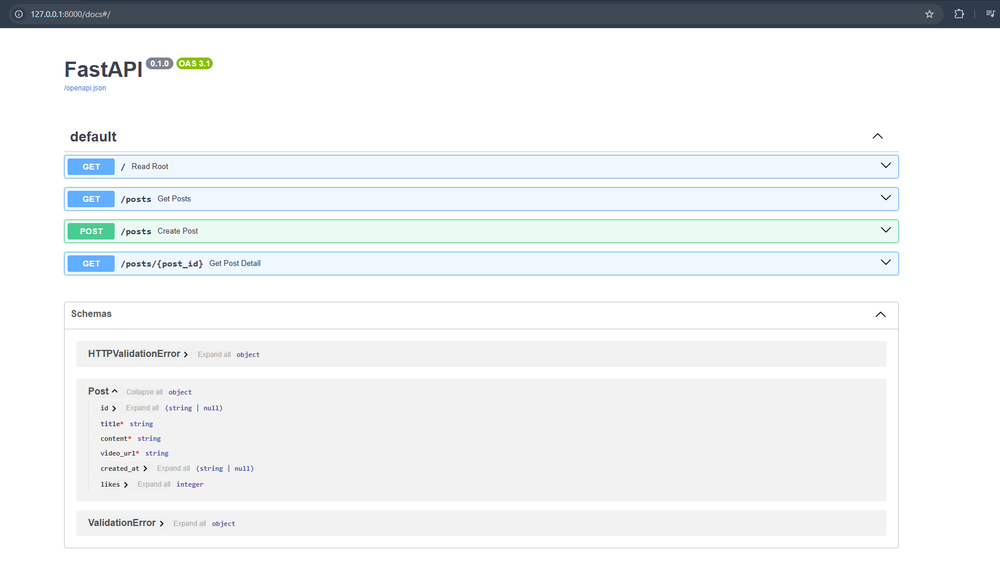
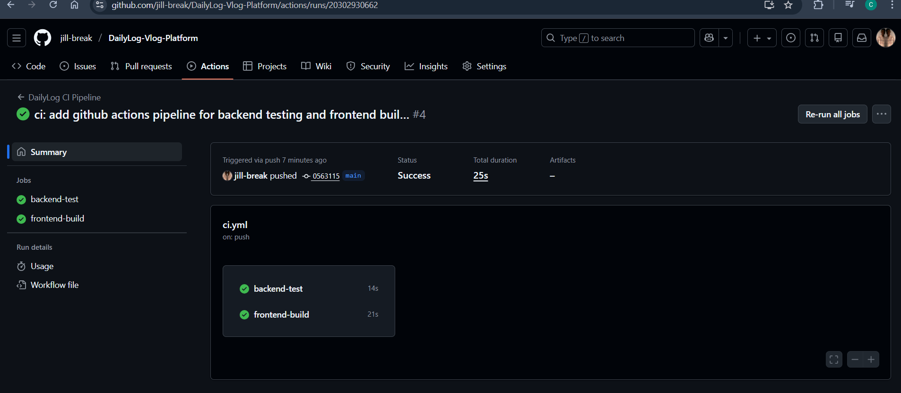

# Sprint 1: Execution (The Walking Skeleton)

**Sprint Goal:** Deliver a working MVP where users can Create and View posts, and establish a CI/CD pipeline.
**Status:** In Progress
**Selected User Stories:** US-1 (Create Post), US-2 (View List), US-3 (View Details)

---

## 1. Task Breakdown & Status
*This section tracks the technical tasks required to complete the selected User Stories.*

### **Backend (Python/FastAPI)**
- [x] Initialize Project Structure & Virtual Environment
- [x] Create In-Memory "Database" (List)
- [x] **Feature (US-1):** Implement `POST /posts` endpoint
- [x] **Feature (US-2):** Implement `GET /posts` endpoint
- [x] **Testing:** Write Unit Tests (`test_main.py`)
- [ ] **Refactor:** Switch from In-Memory List to PostgreSQL (Planned for Sprint 2)

### **Frontend (Next.js)**
- [x] Initialize Next.js Project
- [X] **Feature (US-2):** Create Homepage to fetch and display posts
- [X] **Feature (US-1):** Create "New Post" Form
- [X] **Feature (US-3):** Create Post Detail Page (Dynamic Route)
- [X] **Integration:** Connect Frontend to Backend API

### **DevOps & Infrastructure**
- [x] Initialize Git Repository & Push to Main
- [X] **CI Pipeline:** Create GitHub Actions workflow (`ci.yml`) to run tests automatically
- [ ] **Containerization:** Add `Dockerfile` for Backend

---

## 2. CI/CD Evidence
* **Pipeline Tool:** GitHub Actions
* **Triggers:** Push to `main`, Pull Requests
* **Stages:**
    1.  Checkout Code
    2.  Install Python Dependencies
    3.  Run `pytest`
* **Status:** (`.github/workflows/ci.yml`)

---

## 3. Sprint Review (Demo)
**Date:** 17 December 2025
**Status:** Completed

### **Delivered Features**
I successfully delivered the "Walking Skeleton" of the application, fulfilling the following User Stories:
* **US-1 (Create Post):** Users can submit a title, content, and video URL. The backend assigns a unique ID and timestamp.
* **US-2 (View List):** The Homepage fetches the list of posts from the Python API and displays them in reverse chronological order.
* **US-3 (View Details):** Basic routing is established.

### **Evidence of Work**

#### **1. The Working Application**
*The Homepage showing the "Create Post" form and the list of Vlogs coming from the Backend.*

*(Note: I have verified that submitting the form updates the list immediately without page reload.)*

#### **2. API Documentation (Swagger UI)**
*The FastAPI automatic documentation showing the successful `/posts` endpoints.*

#### **3. CI/CD Pipeline Success**
*GitHub Actions showing the "Green" success status for the Python Tests and Frontend Build.*

---

## 4. Retrospective
**Participants:** Solo Developer
**Duration:** 1 Sprint

### **What went well?**
* **Separation of Concerns:** Using a Hybrid Stack (FastAPI + Next.js) allowed me to test the backend logic independently before building the UI. This made debugging much easier.
* **Automated Testing:** Writing the unit test for `create_post` early meant I could verify my API changes without constantly clicking through the frontend.

### **What didn't go well? (Challenges)**
* **CI/CD Configuration:** My first 3 CI pipeline run failed because of a Python version and nextjs version mismatch. My local environment was using Python 3.10+, but the GitHub Action was set to 3.9, causing a dependency conflict with the `click` library, the Next.js version was set to 18 while my local machine was set to 20.
* **CORS Issues:** I initially forgot to configure CORS on the backend, which caused the Frontend to fail when fetching data. I had to research and add the `CORSMiddleware`.

### **Improvements for Sprint 2 (Action Plan)**
* **1. Automate Database Setup:** Currently, I am using an in-memory list which resets every time the server restarts. In Sprint 2, I will implement **Docker Compose** to spin up a real PostgreSQL database automatically.
* **2. Improve Code Quality Checks:** I realized I don't have a standard way to check for code style. In Sprint 2, I will add a **Linter (Flake8)** to the CI pipeline to catch style issues before they are merged.