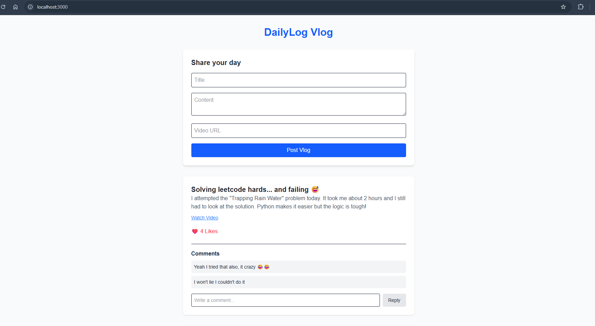
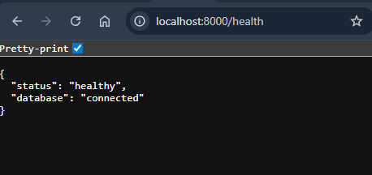
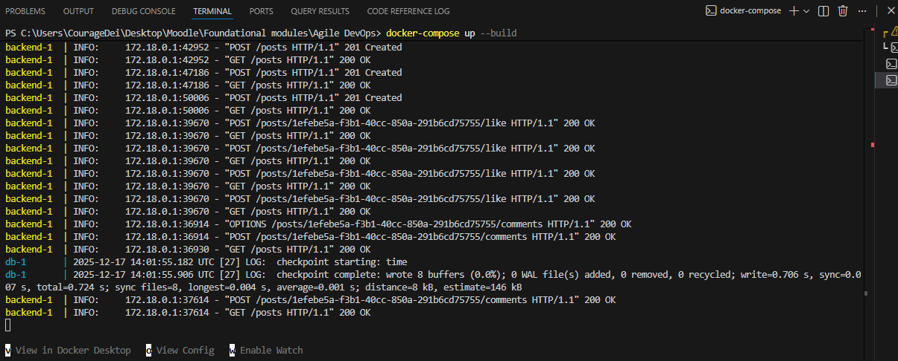
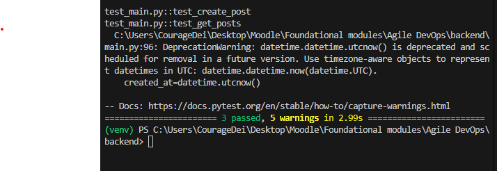

# Sprint 2: Execution & Improvement

**Sprint Goal:** Persist data using PostgreSQL, add user engagement features (Likes/Comments), and implement monitoring.
**Status:** Completed
**Date:** 17 December 2025

---

## 1. Task Breakdown & Status
### **Process Improvements (Refactoring)**
- [x] **Infrastructure:** Set up Docker Compose for PostgreSQL Database to ensure data persistence (Fixing Sprint 1 issue).
- [x] **Backend:** Refactored `main.py` to use SQLAlchemy ORM instead of in-memory lists.
- [x] **Testing:** Updated `test_main.py` to use a temporary SQLite database to isolate tests from the production DB.

### **New Features**
- [x] **US-4 (Likes):** Implemented `POST /posts/{id}/like` and connected it to the Frontend heart icon.
- [x] **US-5 (Comments):** Created `CommentDB` model, established One-to-Many relationship with Posts, and built the Comment UI.

### **DevOps & Monitoring**
- [x] **Monitoring:** Added `/health` endpoint returning database connection status.
- [x] **CI/CD:** Pipeline is Green (passing) after fixing the Python version mismatch from Sprint 1.

---

## 2. Sprint Review (Demo)

### **Delivered Features**
I delivered the final two user stories and improved the system architecture.
* **Data Persistence:** Vlogs and comments now survive server restarts thanks to the Dockerized PostgreSQL database.
* **Engagement:** Users can now interact with content. The "Like" count updates instantly.

### **Evidence of Work**

#### **1. The Commenting Feature (US-5)**
*Screenshot showing a post with multiple comments and the input form.*

#### **2. Monitoring Endpoint**
*Browser screenshot of `localhost:8000/health` showing `{"status": "healthy"}`.*

#### **3. Docker Infrastructure**
*Terminal screenshot showing `docker-compose up` running both the Backend and Database services successfully.*

---

## 3. Final Retrospective
*Reflection on the entire project lifecycle and process improvements.*

**1. Improvements from Sprint 1**
* **Database Automation:** In Sprint 1, I noted that losing data on every restart was inefficient. In Sprint 2, I successfully implemented **Docker Compose**. This allowed me to spin up a real PostgreSQL database with a single command, matching the production environment.
* **Testing Strategy:** I encountered issues where my tests depended on the real database. I improved this by refactoring `test_main.py` to use `sqlite:///:memory:`. This made my CI pipeline faster and more reliable, as it no longer requires a live database connection to run logic checks.

**2. Key Lessons Learned**
* **Environment Parity is Critical:** The biggest challenge was the Python and Next.js version mismatch in the CI pipeline (Local was 3.10 and 20, CI was 3.9 and 18). I learned that defining exact versions in `ci.yml` and `Dockerfile` is essential to prevent "*it works on my machine" errors*.
* **Iterative Delivery Works:** Breaking the project into "Skeleton first" (Sprint 1) and "Features second" (Sprint 2) saved me from getting overwhelmed. I always had a working application to show, even if features were missing.

**3. Future Steps (If project continued)**
* Deploy the Docker containers to a cloud provider like AWS EC2.